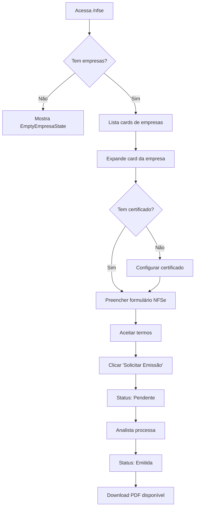

# Página de Emissão de NFSe - Documentação

## Visão Geral

Página completa para emissão de Notas Fiscais de Serviço Eletrônicas (NFSe) na área do cliente.

**Rota:** `/nfse`  
**Acesso:** Apenas usuários com perfil `cliente`  
**Arquivo:** `src/pages/cliente/NFSePage.tsx`

## Estrutura da Página

### 1. Layout Principal

```
┌─────────────────────────────────────────────┐
│ Emissão de NFSe                             │
│ Solicite a emissão de Notas Fiscais...     │
├─────────────────────────────────────────────┤
│ ⓘ Disclaimer: Processo Manual              │
│   Analista contábil - 3 dias úteis          │
├─────────────────────────────────────────────┤
│ [Card Empresa 1] ▼                          │
│   ├─ [Certificado Digital] ▼               │
│   │   └─ Upload + Senha + Validade         │
│   ├─ [Emissão de NFSe] ▼                   │
│   │   └─ Formulário completo                │
│   └─ [Histórico de Solicitações]           │
├─────────────────────────────────────────────┤
│ [Card Empresa 2] ▼                          │
│   └─ ...                                    │
└─────────────────────────────────────────────┘
```

### 2. Cards Colapsáveis por Empresa

Cada empresa cadastrada tem seu próprio card com:
- **Header:** Razão social/CNPJ + Badge de status do certificado
- **Conteúdo expandido:** Duas seções principais

#### Seção 1: Certificado Digital 🔑

**Status do Certificado:**
- ✅ **Com certificado:** Badge verde + data de validade
- ⚠️ **Sem certificado:** Badge amarelo + aviso

**Formulário:**
- Upload de arquivo (.pfx ou .p12)
- Campo de senha (obrigatório)
- Data de validade (opcional)
- Botão "Salvar Certificado"

**Comportamento:**
- Se já existe certificado: permite atualizar
- Se não existe: cria novo
- Constraint UNIQUE: 1 certificado por empresa
- Arquivo salvo em: `storage/certificados/{empresa_id}-{timestamp}.pfx`

#### Seção 2: Emissão de NFSe 📄

**Campos Obrigatórios (*):**
- Data de Competência
- CPF/CNPJ do Tomador
- Nome do Tomador
- Descrição dos Serviços
- Valor dos Serviços

**Campos Opcionais:**
- Email do Tomador
- Telefone do Tomador
- Endereço completo (Rua, Número, Bairro, CEP, Cidade, UF)
- Observações

**Validações:**
- Certificado digital deve estar configurado
- Todos os campos obrigatórios preenchidos
- Termos de uso devem ser aceitos
- Valor deve ser maior que 0

**Termos de Uso:**
```
☑️ Aceito os termos de uso do serviço de emissão de NFSe 
   e estou ciente de que a nota será processada por um 
   analista contábil em até 3 dias úteis. *
```

**Botão de Ação:**
- "Solicitar Emissão"
- Desabilitado se: sem certificado OU campos vazios OU termos não aceitos

#### Seção 3: Histórico de Solicitações 🕐

Lista todas as NFSes solicitadas para a empresa:
- Nome do tomador
- Data de competência
- Valor
- Status (badge colorido)
- Link para download do PDF (se disponível)

**Status Possíveis:**
- 🟡 **Pendente:** Aguardando processamento
- 🔵 **Processando:** Analista trabalhando
- 🟢 **Emitida:** Concluída com sucesso
- 🔴 **Cancelada:** Solicitação cancelada
- 🔴 **Erro:** Falha no processamento

## Fluxo de Uso

### Fluxo Completo do Cliente



### Passo a Passo

1. **Cliente acessa a página**
   - Sistema carrega empresas do usuário
   - Carrega certificados existentes
   - Carrega histórico de NFSes

2. **Configura certificado (primeira vez)**
   - Faz upload do arquivo .pfx ou .p12
   - Informa a senha do certificado
   - Opcional: data de validade
   - Sistema salva no storage e tabela

3. **Solicita emissão de NFSe**
   - Preenche dados do tomador (cliente)
   - Informa descrição e valor do serviço
   - Aceita os termos de uso
   - Clica em "Solicitar Emissão"

4. **Sistema processa**
   - Valida todos os campos
   - Cria registro na tabela `nfse`
   - Status inicial: "pendente"
   - Mostra mensagem de sucesso

5. **Analista processa (backend)**
   - Vê lista de solicitações pendentes
   - Processa com prefeitura
   - Atualiza status e faz upload do PDF
   - Cliente recebe notificação

6. **Cliente visualiza resultado**
   - Vê status atualizado no histórico
   - Faz download do PDF (se emitida)
   - Vê mensagem de erro (se houver)

## Integrações

### Tabelas do Banco

**certificados_digitais:**
```typescript
{
  id: UUID
  empresa_id: UUID (FK empresa)
  user_id: UUID (FK auth.users)
  certificado_url: TEXT (URL do storage)
  certificado_senha: TEXT (criptografada)
  data_validade: DATE
  ativo: BOOLEAN
  created_at: TIMESTAMP
  updated_at: TIMESTAMP
}
```

**nfse:**
```typescript
{
  id: UUID
  empresa_id: UUID (FK empresa)
  user_id: UUID (FK auth.users)
  
  // RPS
  numero_rps: VARCHAR(50)
  serie_rps: VARCHAR(10)
  data_emissao: DATE
  data_competencia: DATE (obrigatório)
  
  // Tomador
  tomador_cpf_cnpj: VARCHAR(14) (obrigatório)
  tomador_nome: TEXT (obrigatório)
  tomador_email: VARCHAR(255)
  tomador_telefone: VARCHAR(20)
  tomador_endereco: TEXT
  tomador_numero: VARCHAR(10)
  tomador_complemento: VARCHAR(100)
  tomador_bairro: VARCHAR(100)
  tomador_cidade: VARCHAR(100)
  tomador_uf: VARCHAR(2)
  tomador_cep: VARCHAR(8)
  
  // Serviço
  descricao_servicos: TEXT (obrigatório)
  valor_servicos: NUMERIC(10,2) (obrigatório)
  aliquota_iss: NUMERIC(5,2)
  valor_iss: NUMERIC(10,2)
  // ... outros impostos
  
  // Status
  status: VARCHAR(50) DEFAULT 'pendente'
  numero_nfse: VARCHAR(50)
  codigo_verificacao: VARCHAR(100)
  data_emissao_nfse: TIMESTAMP
  
  // Arquivos
  xml_url: TEXT
  pdf_url: TEXT
  
  // Outros
  observacoes: TEXT
  erro_mensagem: TEXT
  created_at: TIMESTAMP
  updated_at: TIMESTAMP
}
```

### Storage Supabase

**Bucket:** `certificados` (privado)

**Estrutura de arquivos:**
```
certificados/
  └─ {empresa_id}-{timestamp}.pfx
```

**Políticas RLS:**
- Usuários: CRUD nos próprios certificados
- Admins: Leitura de todos os certificados
- Público: SEM ACESSO

### APIs Utilizadas

**Supabase Client:**
```typescript
// Carregar empresas
supabase.from('empresa').select('*').eq('user_id', userId)

// Carregar certificados
supabase.from('certificados_digitais').select('*')
  .in('empresa_id', empresaIds)

// Carregar NFSes
supabase.from('nfse').select('*')
  .in('empresa_id', empresaIds)
  .order('created_at', { ascending: false })

// Upload certificado
supabase.storage.from('certificados').upload(filePath, file)

// Inserir certificado
supabase.from('certificados_digitais').insert(dados)

// Atualizar certificado
supabase.from('certificados_digitais').update(dados).eq('id', id)

// Solicitar emissão
supabase.from('nfse').insert(dados)
```

## Estados e Gerenciamento

### Estados Principais

```typescript
const [empresas, setEmpresas] = useState<EmpresaComDados[]>([])
const [expandedCard, setExpandedCard] = useState<string | null>(null)
const [expandedSection, setExpandedSection] = useState<{...}>({})
const [loading, setLoading] = useState(true)
const [salvando, setSalvando] = useState(false)
const [solicitando, setSolicitando] = useState(false)
const [termosAceitos, setTermosAceitos] = useState<{...}>({})
const [alert, setAlert] = useState<Alert | null>(null)

// Certificado
const [certificadoFile, setCertificadoFile] = useState<{...}>({})
const [certificadoSenha, setCertificadoSenha] = useState<{...}>({})
const [certificadoValidade, setCertificadoValidade] = useState<{...}>({})

// NFSe
const [nfseForm, setNfseForm] = useState<{...}>({})
```

### Funções Principais

**loadEmpresas():**
- Carrega empresas do usuário
- Carrega certificados relacionados
- Carrega histórico de NFSes
- Combina dados em um array único

**handleUploadCertificado(empresaId):**
- Valida arquivo e senha
- Faz upload para storage
- Insere/atualiza registro na tabela
- Recarrega dados

**handleSolicitarEmissao(empresaId):**
- Valida certificado configurado
- Valida campos obrigatórios
- Valida termos aceitos
- Insere registro na tabela nfse
- Recarrega dados

**updateNfseForm(empresaId, field, value):**
- Atualiza campo específico do formulário
- Mantém outros campos intactos

## UI/UX

### Componentes Utilizados

- **DashboardLayout:** Layout padrão com sidebar
- **Card:** Container com shadow e border-radius
- **Alert:** Mensagens de feedback (success/error/info)
- **Badge:** Indicadores de status coloridos
- **EmptyEmpresaState:** Estado vazio quando sem empresas
- **Icons:** lucide-react (ChevronDown, FileText, Key, etc.)

### Cores e Badges

**Status NFSe:**
- 🟡 Pendente: `Badge color="warning"`
- 🔵 Processando: `Badge color="info"`
- 🟢 Emitida: `Badge color="success"`
- 🔴 Cancelada: `Badge color="danger"`
- 🔴 Erro: `Badge color="danger"`

**Certificado:**
- ✅ Configurado: `Badge color="success"` + CheckCircle2
- ⚠️ Não configurado: `Badge color="warning"` + AlertCircle

### Responsividade

- **Desktop:** Grid 2 colunas para campos
- **Mobile:** Grid 1 coluna (stack)
- Breakpoint: `md:grid-cols-2`

## Segurança

### Validações

**Frontend:**
- ✅ Certificado configurado antes de emitir
- ✅ Campos obrigatórios preenchidos
- ✅ Termos aceitos
- ✅ Arquivo .pfx ou .p12
- ✅ Senha não vazia

**Backend (RLS):**
- ✅ User só vê suas próprias empresas
- ✅ User só vê seus próprios certificados
- ✅ User só vê suas próprias NFSes
- ✅ Admin vê tudo

### Considerações de Segurança

⚠️ **IMPORTANTE:**

1. **Senha do certificado:**
   - Atualmente armazenada em texto plano
   - **TODO:** Implementar criptografia (AES-256)
   - Usar biblioteca crypto-js ou similar

2. **Certificado digital:**
   - Arquivo .pfx já é criptografado
   - Armazenado em bucket privado
   - Acesso restrito por RLS

3. **Dados sensíveis:**
   - CPF/CNPJ sem máscara no banco
   - Valores monetários em NUMERIC(10,2)
   - Logs de auditoria recomendados

## Melhorias Futuras

### Curto Prazo

- [ ] Criptografar senha do certificado
- [ ] Máscaras nos campos (CPF/CNPJ, telefone, CEP)
- [ ] Validação de CPF/CNPJ
- [ ] Busca de CEP automática
- [ ] Preview do PDF antes de solicitar

### Médio Prazo

- [ ] Integração automática com prefeituras
- [ ] Processamento assíncrono (queue)
- [ ] Notificações em tempo real
- [ ] Relatórios de NFSes emitidas
- [ ] Exportação para Excel/CSV

### Longo Prazo

- [ ] Emissão em lote
- [ ] Templates de serviços
- [ ] Agendamento de emissão
- [ ] Cancelamento de NFSe
- [ ] Integração com contabilidade

## Testes

### Checklist de Teste

**Configuração de Certificado:**
- [ ] Upload de arquivo .pfx funciona
- [ ] Upload de arquivo .p12 funciona
- [ ] Senha obrigatória
- [ ] Data de validade opcional
- [ ] Atualização de certificado existente
- [ ] Badge "Certificado OK" aparece após salvar

**Emissão de NFSe:**
- [ ] Campos obrigatórios validados
- [ ] Não permite emitir sem certificado
- [ ] Não permite emitir sem termos aceitos
- [ ] Formulário limpa após solicitação
- [ ] Aparece no histórico imediatamente
- [ ] Status "Pendente" correto

**Histórico:**
- [ ] Lista NFSes da empresa correta
- [ ] Badges de status corretos
- [ ] Link de PDF aparece quando disponível
- [ ] Ordenação por data (mais recente primeiro)

**Responsividade:**
- [ ] Layout funciona em mobile
- [ ] Cards colapsam corretamente
- [ ] Formulário usável em telas pequenas

**Segurança:**
- [ ] RLS impede acesso a dados de outros usuários
- [ ] Storage restringe acesso aos certificados
- [ ] Usuário não autenticado é redirecionado

## Suporte

### Logs e Debugging

Console logs implementados:
```typescript
console.log('🔄 Carregando empresas...')
console.log('📋 Empresas carregadas:', empresas)
console.error('❌ Erro ao carregar:', error)
console.log('💾 Salvando certificado...')
console.log('📤 Solicitando emissão...')
```

### Mensagens de Erro Comuns

**"Erro ao salvar certificado":**
- Verificar se bucket 'certificados' existe
- Verificar políticas de storage
- Verificar autenticação do usuário

**"Configure o certificado digital":**
- Empresa não tem certificado cadastrado
- Salvar certificado antes de emitir

**"Preencha todos os campos obrigatórios":**
- Campos marcados com * estão vazios
- Verificar data_competencia, tomador_*, descricao_servicos, valor_servicos

**"Aceite os termos de uso":**
- Checkbox de termos não marcado
- Marcar antes de clicar em "Solicitar Emissão"

## Conclusão

A página de emissão de NFSe está completa e funcional, implementando:
✅ Upload de certificados digitais
✅ Formulário completo de emissão
✅ Disclaimer sobre processo manual
✅ Termos de uso obrigatórios
✅ Histórico de solicitações
✅ Cards colapsáveis por empresa
✅ Validações de segurança (RLS)
✅ UI/UX intuitiva e responsiva

**Próximo passo:** Executar os scripts SQL no Supabase para ativar a funcionalidade!
